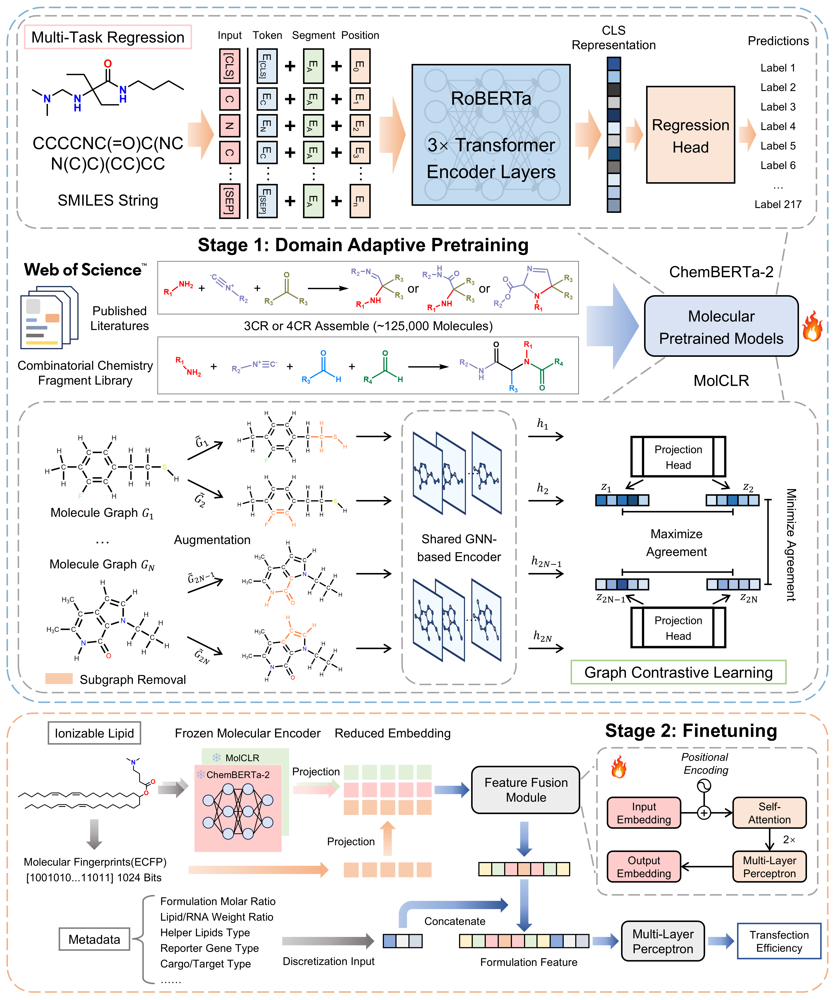

## Transformer-Based Multidimensional Feature Fusion for Accurate Prediction of Lipid Nanoparticles Transfection Efficiency ##

This is the official implementation of LIFT: "Transformer-Based Multidimensional Feature Fusion for Accurate Prediction of Lipid Nanoparticles Transfection Efficiency". In this work, we introduce LNPs Integrated Feature-fusion Transformer (LIFT), a multidimensional feature fusion framework for accurate LNPs transfection efficiency prediction.



## Getting Started

### Installation

Clone the github repo and set up conda environment

```
# clone the source code of MolCLR
$ git clone https://github.com/U12458/LIFT.git
$ cd LIFT

# create a new environment
$ conda env create -f environment.yml
$ conda activate LIFT

# install requirements
$ pip install torch-scatter torch-sparse torch-cluster torch-spline-conv torch-geometric
$ conda install -c conda-forge nvidia-apex # optional
```

### Dataset

The pre-training dataset LNP-IL and LNPs transfection efficiency benchmark sub-datasets LNP-TE used in the paper can be found in ./dataset.

### Domain-adaptive Pretraining

1. To perform domain-adaptive pretraining for the $\text{ChemBERTa-2}_{MTR}$, please refer to official implementation of ChemBERTa [https://github.com/seyonechithrananda/bert-loves-chemistry/blob/master/chemberta/train/test_mtr.sh]
2. To perform domain-adaptive pretraining for the MolCLR topology graph encoder, please refer to `config_pretrain.yaml` for configuration details and explanations of each variable.
```
# Run domain-adaptive pretraining
$ cd ./pretrain
$ python pretrain.py
```

### Random Splitting

For simple reproduction, please perform:
```
$ python reproduction.py
```

To fine-tune the LIFT model on random splitting experiments, where the configurations and hyperparameter setting can be found in `config.json`
```
$ python train.py --config config.json
```

### Scaffold-based Cross Validation

```
$ cd ./tasks/Cross\ Validation
```

For simple reproduction, please perform:
```
$ python reproduction.py
```

To fine-tune the LIFT model on scaffold-based cross validation experiments(for regression: "AGILE HeLa", "AGILE RAW" sub-datasets; for multi-class classification: "iPhos", "Den HeLa" sub-datasets), where the configurations and hyperparameter setting can be found in `config.json`
```
$ python train.py --config config.json
```

### Activity Cliff

```
$ cd ./tasks/Activity\ Cliff
```

For simple reproduction and inference, please perform:
```
$ python reproduction.py
```

To construct the LNPs transfection efficiency activity cliff data pairs, please perform:
```
# Step 1: Construct activity cliff data pairs
$ python data_splitter.py --config ./configs/data_splitter.json
```

To fine-tune the LIFT model on activity cliff experiment(for "AGILE HeLa" and "AGILE RAW" sub-datasets), where the configurations and hyperparameter setting can be found in `activity_cliff.json`
```
# Step 2: Fine-tune on the activity cliff task
$ python activity_cliff.py --config ./configs/activity_cliff.json
```

## Acknowledgement
- ChemBERTa: [https://github.com/seyonechithrananda/bert-loves-chemistry.git](https://github.com/seyonechithrananda/bert-loves-chemistry.git)
- MolCLR: [https://github.com/yuyangw/MolCLR.git](https://github.com/yuyangw/MolCLR.git)
- AGILE: [https://github.com/bowang-lab/AGILE.git](https://github.com/bowang-lab/AGILE.git)

If you find our work useful in your research, please cite:

```
@article{
  title={Transformer-Based Multidimensional Feature Fusion for Accurate Prediction of Lipid Nanoparticles Transfection Efficiency},
  author={Daohong Gong, Xiaowei Xie, Jianxin Tang, Shiliang Li and Honglin Li},
}
```
